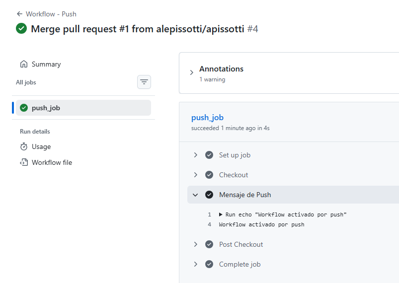
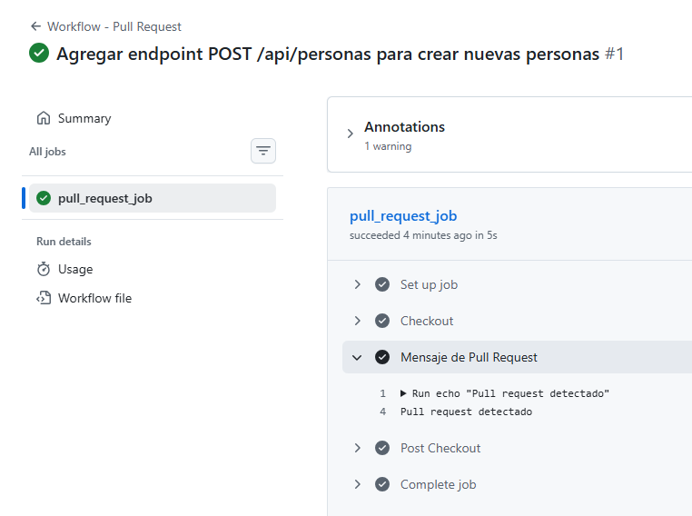
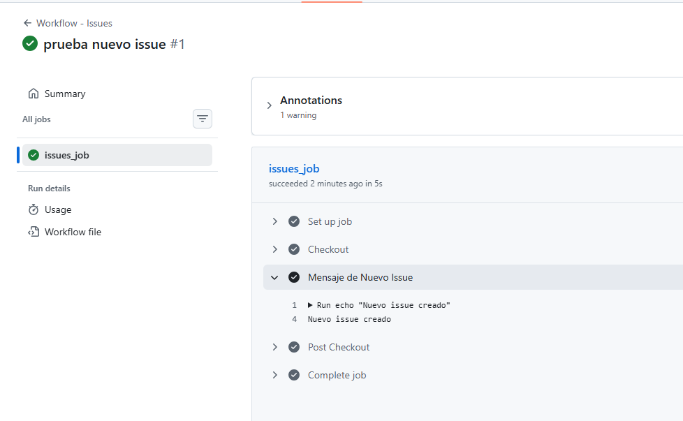
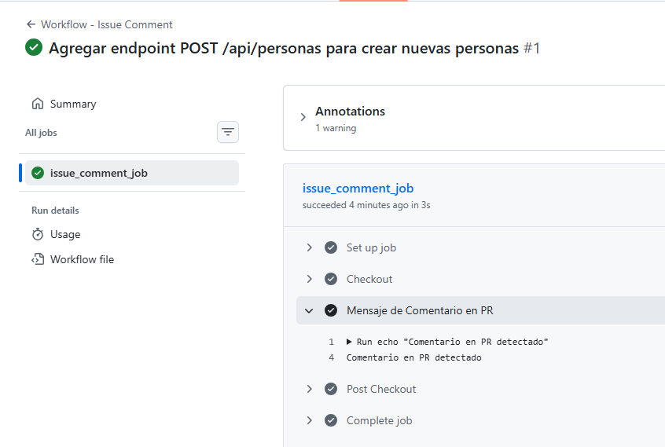
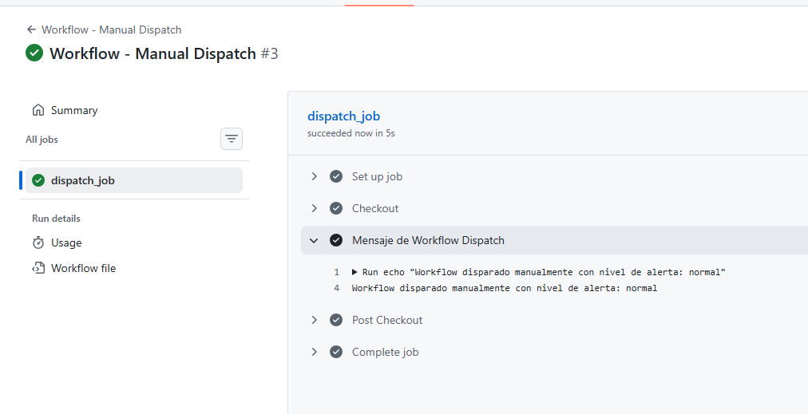

# GitHub Actions: Implementación de Workflows y Triggers

**Nombre:** Alejandro Pissotti

## 📝 Descripción del Proyecto
Este proyecto demuestra la implementación de diversos flujos de trabajo automatizados mediante **GitHub Actions**. Se han configurado triggers específicos para cubrir el ciclo de vida completo de un repositorio, desde la gestión de tareas (Issues) hasta la integración de código (Push/PR) y ejecuciones manuales.

## ⚙️ Detalle de los Workflows y Triggers

1.  **Push (`on: push`):** Se activa automáticamente al subir cambios a la rama principal. Es la base para procesos de Integración Continua (CI).
2.  **Pull Request (`on: pull_request`):** Se dispara al abrir o actualizar un PR. Permite validar el código antes de ser incorporado a la rama base.
3.  **Issues (`on: issues`):** Se ejecuta al crear, editar o cerrar un issue. Útil para automatizar la organización del proyecto.
4.  **Issue Comment (`on: issue_comment`):** Se activa al recibir comentarios en Issues o Pull Requests, permitiendo interactuar con los usuarios de forma automática.
5.  **Manual Dispatch (`on: workflow_dispatch`):** Permite la ejecución manual del workflow desde la pestaña "Actions" de GitHub, admitiendo parámetros personalizados (ej. nivel de alerta).
6.  **Schedule (`on: schedule`):** (Configurado por cron) Ejecuta tareas en intervalos de tiempo definidos para mantenimiento o reportes periódicos.

---

## 📸 Evidencias de Ejecución

### 1. Workflow: Push
Confirmación de activación tras un push/merge en la rama principal.

### 2. Workflow: Pull Request
Detección de evento al crear un PR para nuevos endpoints.

### 3. Workflow: New Issue
Ejecución disparada por la creación de un nuevo issue de prueba.

### 4. Workflow: Issue Comment
Validación del trigger al detectar comentarios en un hilo de PR o Issue.

### 5. Workflow: Manual Dispatch
Ejecución manual exitosa con parámetros de entrada personalizados.

---

## 🛠️ Tecnologías Utilizadas
- **GitHub Actions**
- **YAML** para la definición de workflows.
- **Git/GitHub** para control de versiones.
